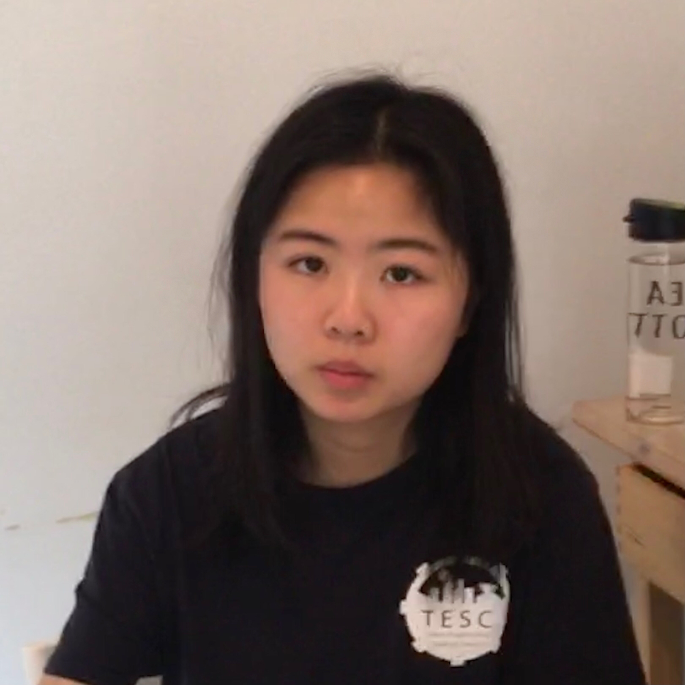

# Judy Liu 
 
# Computer Science Undergraduate @ UC San Diego

[Contact](#Contact) <br>
[About me](#About-me) <br>
[Experiences](#Experiences) <br>
[Fun code](#Fun-code)

## Contact:
- liulexuan886@gmail.com
- [GitHub](https://github.com/judyliu14)
- [Linkedin](https://www.linkedin.com/in/judyliu14/)

## About me:
> I am a dedicated undergraduate engineering student majoring in Computer Science with a strong focus in *object-oriented design*. I am proficient in languages including Java, C/C++, and Python. I am highly experienced in application development such as Objective-C for iOS, and NodeJS framework for web development. I can work well both independently and in a team. I am an adaptive learner who is looking forward to learning new technical skills.


## Experiences

### ASGS Web Developer
- Create and maintain websites for UCSD events including Triton-Fest, Black History Month, and ASCE.
- Example work: [Triton-Fest-Design](Web.jpg), [Triton-Fest-Website](https://tritonfest.ucsd.edu/)

### Student Researcher
Advisor: Tajana Rosing
- Researching under the topic of Hyperdimensional computing.

### Software Engineering Intern
Orka Inc., Palo Alto, CA
- Developed and published the iOS app [Orka Health](https://apps.apple.com/us/app/orka-health/id1525826891) that connects with hearing aid via Bluetooth, providing **remote control and telehealth functionalities** including volume control and music streaming mode switcher.
- Assisted in the development of deep learning convolutional neural networks for computer vision.
- Practiced **industry best practices** such as: building scalable applications, conducting code reviews, performing monkey testing, and publishing apps to App Store

## Fun code

```
public static void main(String[] args) {
    System.out.println("Hello Judy!");
}
```

## Hobbies

1. Dancing
2. Cooking
3. Swimming

## Current Tasks
- [x] Make a personal website
- [ ] Excell in CSE 110 (Software Engineering)
- [ ] Contribute to current research